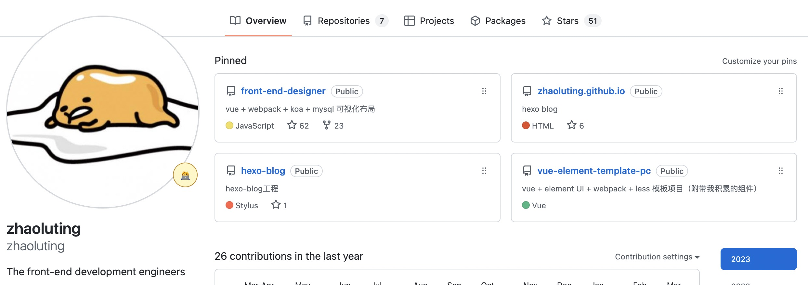

<!-- 
_paginate: false
_footer: '前端组 2023年04月21日'
_class: homePage
-->

# 晋升答辩

**汇报人：凉亭-赵璐婷**

---
<!-- 
_header: 自我介绍
_class: contentPage horizontalLayout gorgeousTag
-->

- **花名-姓名** 凉亭-赵璐婷
- **入职时间** 2021年12月29日
- **岗位** 前端开发
- **部门** 技术研发中心-前端部
- **学校** 浙江工业大学 / 2018届本科 / 计算机
- **主页** [个人博客](https://zhaoluting.github.io/)、[GitHub](https://github.com/zhaoluting)

---

<!-- 
_header: 工作内容
_class: contentPage horizontalImages
-->

项目名|工作内容
:---:|---
**产品演示**|独立完成产品演示平台，包括钉钉端前台、后台的开发工作，并负责后续的维护。
**项目运行**|独立完成项目运行，包括移动端、PC端以及大屏，并负责后续的维护。
**积分管理**|独立完成积分系统PC端，并负责后续的维护。

 

---
<!-- 
_header: 工作成果
_class: contentPage horizontalImages
-->

- 参与共计**29个**工作代码仓库，其中地市级**15个**。
- 涉及**26个**PC端，**3个**H5端，**5个**钉钉端，**1个**浙里办，**6个**大屏。
- 参与共计**6个**团队基建仓库，其中独立完成**5个**，协作**1个**。

---
<!-- 
_header: 个人突破
_class: contentPage
-->
### 能力

- 能够积极承担组内规范、记录、分享等工作，协助同事解决问题，经常总结反思，思考能为团队贡献什么，如何更高效地工作，努力克服自己的能力短板，并付诸实践。
- 协作开发项目时，能够主动优先搭建框架和编写公共组件，并完善README和注释说明，在开发初期就做好基础工作，跟进汇总前端的开发进度，及时和后端、测试、产品同步各种信息，协调步调。
- 能够在产品的同意下加入自己的想法，在保证项目进度的情况下，追求用户体验，最大限度地优化性能、操作流程及显示效果，同时保证代码质量，封装高内聚低耦合组件。

### 技术

- 熟悉数据库和服务器，有NodeJS实际项目经验。
- 有丰富的开发经验，移动端、PC端、Hybrid App、浙里办、浙政钉、钉钉、小程序、SDK、浏览器插件等各种端，Vue2、Vue3、React、JQuery、Laravel、Egg、Puppeteer等各种框架，都有实际的项目经验。

---
<!-- 
_header: 学习输出
_class: contentPage horizontalImages
-->

- **前端Chrome插件**：独立设计开发，主要有popup导航、showdoc增强、gitlab增强三大核心功能，具备可配置化、可视化功能，组内已推广并稳定使用，大大提升了工作效率。
- **前端项目管理**：独立设计开发，完成前端和node服务端代码，目前已完成登录、用户管理、角色管理、项目管理、分支管理、计划管理、快速部署模块，并在Jenkins上完成前后端的自动化部署配置。

---
<!-- 
_header: 工作反思
_class: contentPage horizontalLayout
-->

- 偏内向，比较社恐，不太自信，公司活动参加的比较少，和组外的同事交流过少，存在感很低。
- 技能广度不够，后端运维设计项管等相关知识储备还不够，面对项目，着眼的范围比较小，不能很好地站在全局的角度去思考。
- 做技术分享的能力还有待提升，分享时依赖讲稿和文档，比较拘束不够洒脱，还需要多加练习。

---
<!-- 
_header: 未来规划
_class: contentPage horizontalLayout
-->

- 克服社恐，从多做技术分享做起，一边提升前端技能，一边锻炼口才，提高临场反应速度，慢慢适应人多的环境。
- 好好利用公司的前端专用服务器，多做技术创新，将学来的知识用起来，开发实用的工具，推动前端基础建设。
- 扩展前端以外的知识和能力，多看书，多看云课堂，多问为什么，不懂的请教公司里专业的人，早日成为多边形战士，争取能向外部输出。

---
<!--
_paginate: false
_header: ''
_footer: 凉亭-赵璐婷&emsp;2023年04月21日&emsp;Thank you for your time and attention.
_class: thanksPage
-->

## 感谢倾听

 

> 希望自己的付出能够得到领导和同事的认可，
> 我会更加努力，创造价值！
