<!-- 
_paginate: false
_footer: ''
_class: homePage
-->

# 晋升答辩
#### 汇报人：凉亭-赵璐婷
  
##### 项目交付中心-项目三部-前端开发
##### 2023年04月21日

---
<!-- 
_header: 自我介绍
_class: contentPage horizontalLayout gorgeousTag
-->

<!-- - **工龄** 约5年 -->
<!-- - **职级** T1.3 -->

- **花名-姓名** 凉亭-赵璐婷
- **入职时间** 2021年12月29日
- **岗位** 前端开发
- **部门** 项目交付中心-项目三部
- **学校** 浙江工业大学 / 2018届本科 / 计算机
- **主页** [个人博客](https://zhaoluting.github.io/)、[GitHub](https://github.com/zhaoluting)、[GitLab Profile](http://192.168.5.166/liangting)

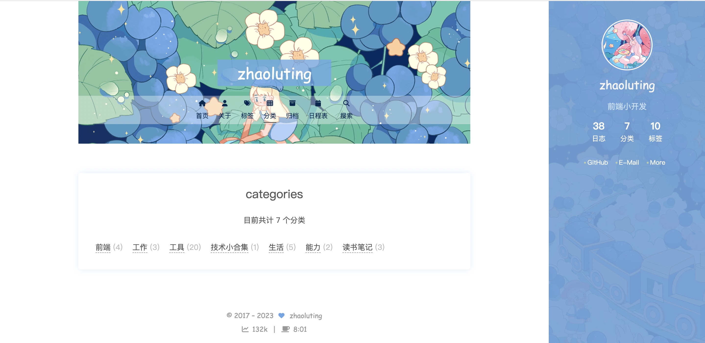

---

<!-- 
_header: 工作内容
_class: contentPage horizontalImages
-->

项目名|工作内容
:---:|---
**数政产品演示平台**|独立完成产品演示平台，包括钉钉端前台、后台的开发工作，并负责后续的维护。
**项目运行v3.0**|独立完成项目运行，包括移动端、PC端以及大屏，并负责后续的维护。
**数政值**|独立完成数政积分系统PC端，并负责后续的维护。

 

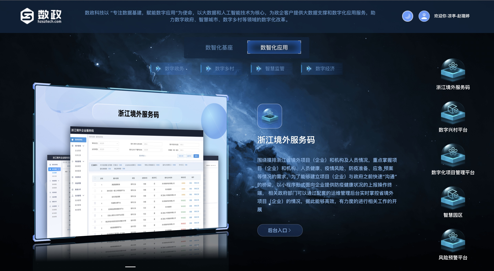
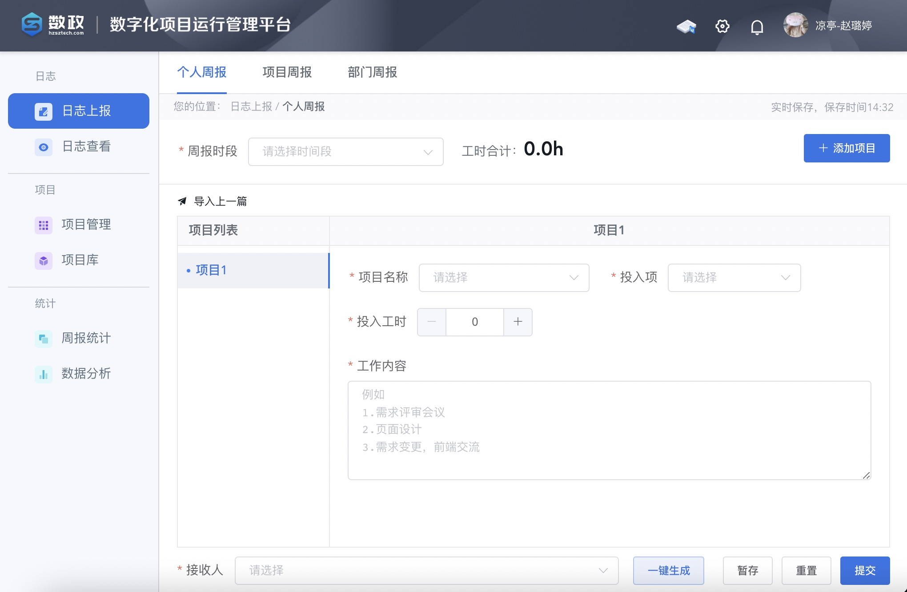
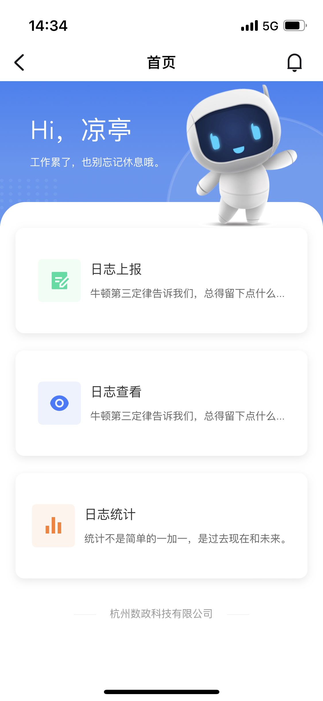

---
<!-- 
_header: 工作内容
_class: contentPage
-->

项目名|工作内容
:---:|---
**社科联**|独立完成大屏，协作开发和维护PC端、H5端，并接入浙政钉、浙里办。
**网络直播营销监测中心**|协作完成中心端和应用端。中心端负责开发登录、监测中心、在线体验大模块以及系统管理模块的应用管理和权限查看，应用端负责开发登录、规则研读、监测中心大模块。
**明厨亮灶**|协作完成企业端，负责开发登录注册、企业认证、审核、首页、企业二维码、我的企业、阳光厨房模块。
**easyDB**|接手项目，目前负责常规版本和「舟山数据同步工具」版本的新需求迭代和维护。
**宁海艺术村**|协作完成艺术村大屏，负责人才专项驾驶舱模块。

---
<!-- 
_header: 工作内容
_class: contentPage
-->
维护地市级公共数据平台项目

地区|子系统
:---:|---
**衢江**|中台、数据工作台、系统管理、问题反馈、数据展示中心、数据交换、数据治理、数据共享、数据展示中心、基层智治大屏内嵌页。
**龙游**|中台、系统管理、问题反馈、场景查询、资源超市、数据交换、数据治理、数据采集。
**复杂美**|中台、用户管理、资源目录、数据采集、数据交换、数据治理、数据共享。
**柯城**|数据共享；协作完成大屏，负责民情档案模块。
**衢州**|资源目录、数据共享、数据交换。
**开化**|数据共享、数据仓库、场景查询。

---
<!-- 
_header: 工作成果
_class: contentPage horizontalImages
-->

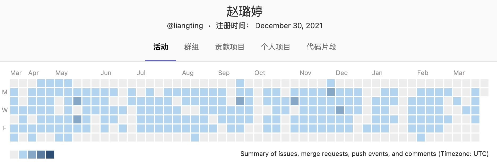

- 参与共计**29个**工作代码仓库，其中地市级**15个**。
- 涉及**26个**PC端，**3个**H5端，**5个**钉钉端，**1个**浙里办，**6个**大屏。
- 参与共计**6个**团队基建仓库，其中独立完成**5个**，协作**1个**。

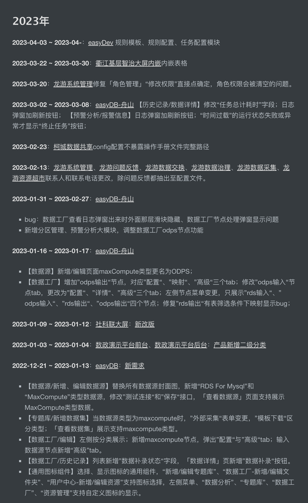
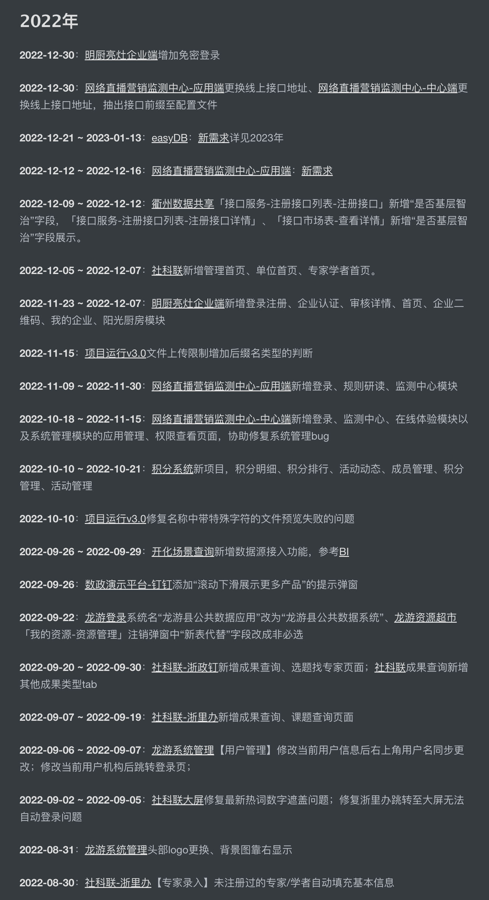
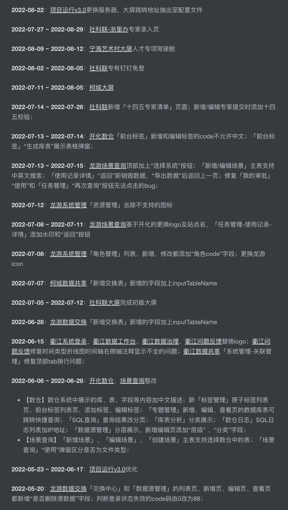
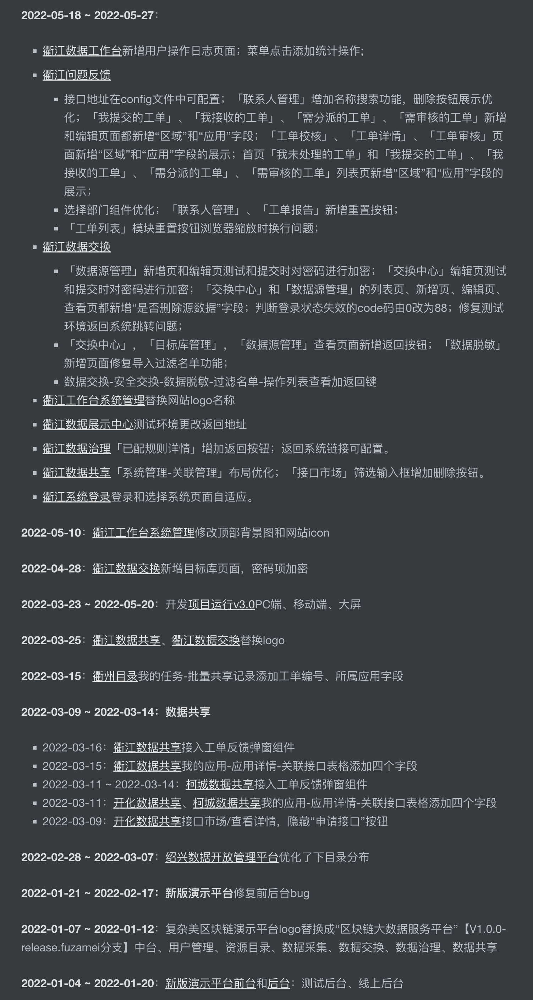

<!--
数政产品演示平台（2）、项目运行（3）、数政值（1）、社科联（3）、网络直播营销监测中心（2）、明厨亮灶（1）、easyDB（1）、宁海艺术村（1）

（15)
中台、数据工作台、系统管理、问题反馈、数据交换、
数据治理、数据共享、数据采集、数据仓库、场景查询、
资源超市、资源目录、数据展示中心、基层智治大屏内嵌页、柯城大屏
-->

---
<!-- 
_header: 个人突破
_class: contentPage
-->
### 能力

- 能够积极承担组内提效、规范、记录、分享等工作，协助同事解决问题，帮助大家共同进步，经常总结反思，思考能为团队贡献什么，如何更高效地工作，努力克服自己的能力短板，并付诸实践。
- 协作开发项目时，能够主动优先搭建框架和编写公共组件，并完善README和注释说明，在开发初期就做好基础工作，跟进汇总前端的开发进度，及时和后端、测试、产品同步各种信息，协调步调。
- 能够在产品的同意下加入自己的想法，在保证项目进度的情况下，追求用户体验，最大限度地优化性能、操作流程及显示效果，同时保证代码质量，封装高内聚低耦合组件。

### 技术

- 会操作数据库和服务器，有NodeJS实际项目经验。
- 有丰富的开发经验，移动端、PC端、Hybrid App、浙里办、浙政钉、钉钉、小程序、SDK、浏览器插件等各种端，Vue2、Vue3、React、JQuery、Laravel、Egg、Puppeteer等各种框架，都有实际的项目经验。

---
<!-- 
_header: 学习输出
_class: contentPage horizontalImages
-->

- **数政前端Chrome插件**：独立设计开发，主要有popup导航、showdoc增强、gitlab增强三大核心功能，具备可配置化、可视化功能，组内已推广并稳定使用，大大提升了工作效率。
- **数组前端项目管理**：独立设计开发，完成前端和node服务端代码，目前已初步完成登录、用户管理、角色管理、项目管理、分支管理模块，并在Jenkins上完成前后端的自动化部署配置。

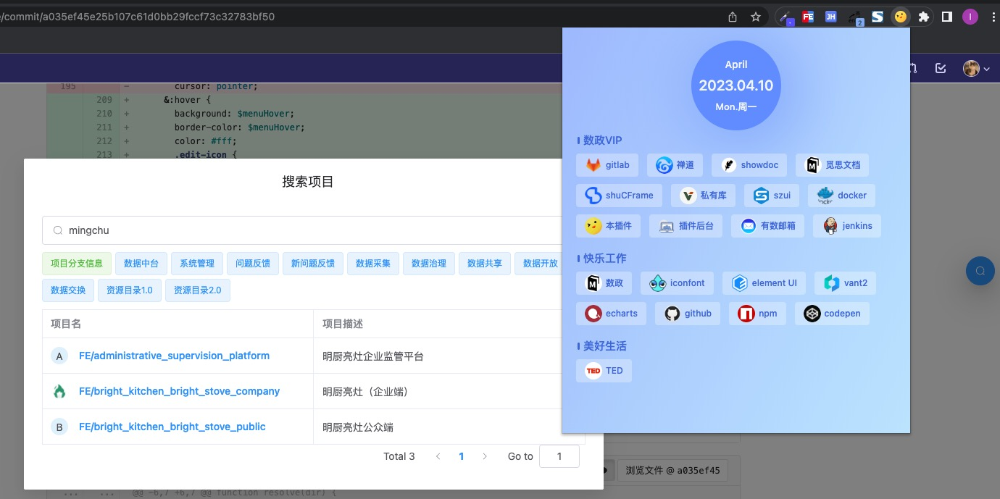
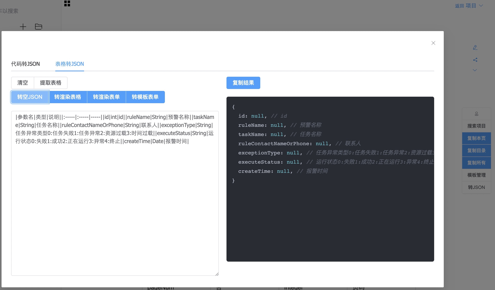
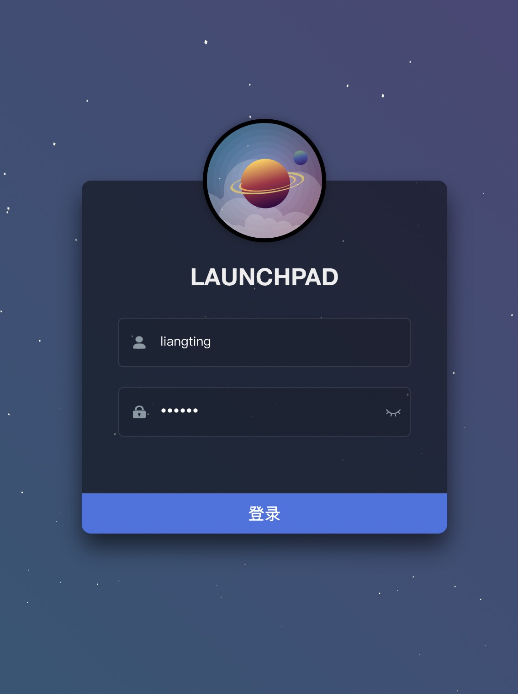
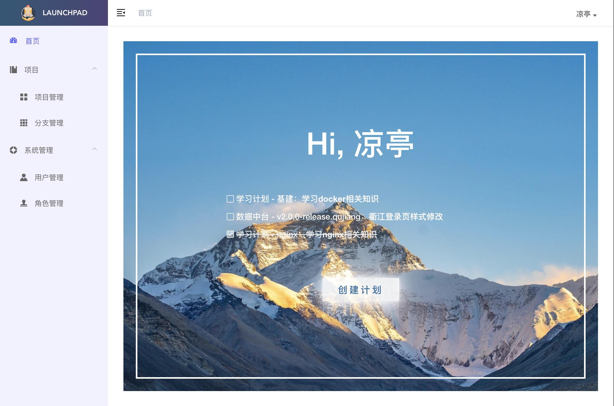

---
<!-- 
_header: 学习输出
_class: contentPage horizontalImages
-->

- **服务器**：帮助推动前端工程化，协助简化并规范测试环境部署流程。完成192.168.5.99、192.168.5.236上nginx、filebrowser、Jenkins的搭建和配置；
- **数政前端基础工具库**：完成基础工具库的搭建和基本功能，包括格式化类、验证类、正则表达式类、集合类、对象类、时间类、URL类、异步类、随机生成类、颜色类、加解密类。
- **数政前端UI组件库**：参与组件库的开发，完成「悬浮按钮」、「滚动数字」组件，编写《贡献指南》，协助规范开发流程。
- **觅思文档**：对文档和文集进行规整，完成23篇文档的记录和分享，带动同事学习，共同提升nginx、docker、git等专业技能。

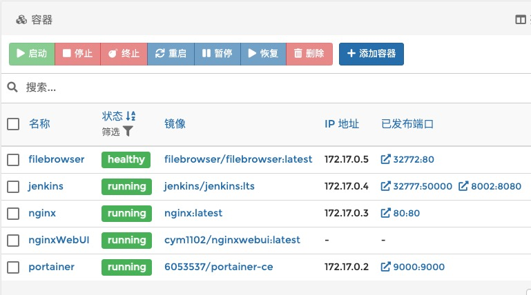
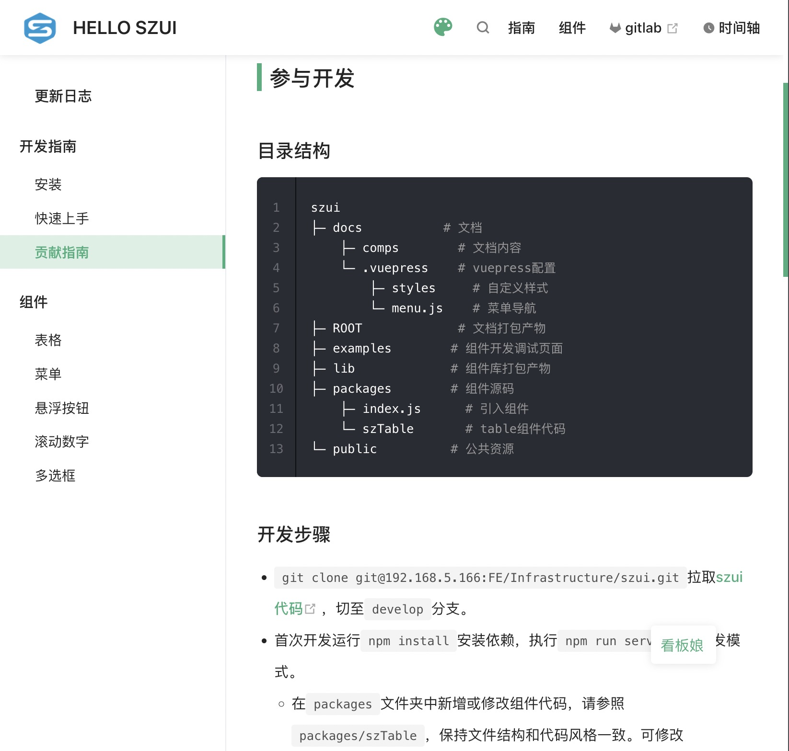
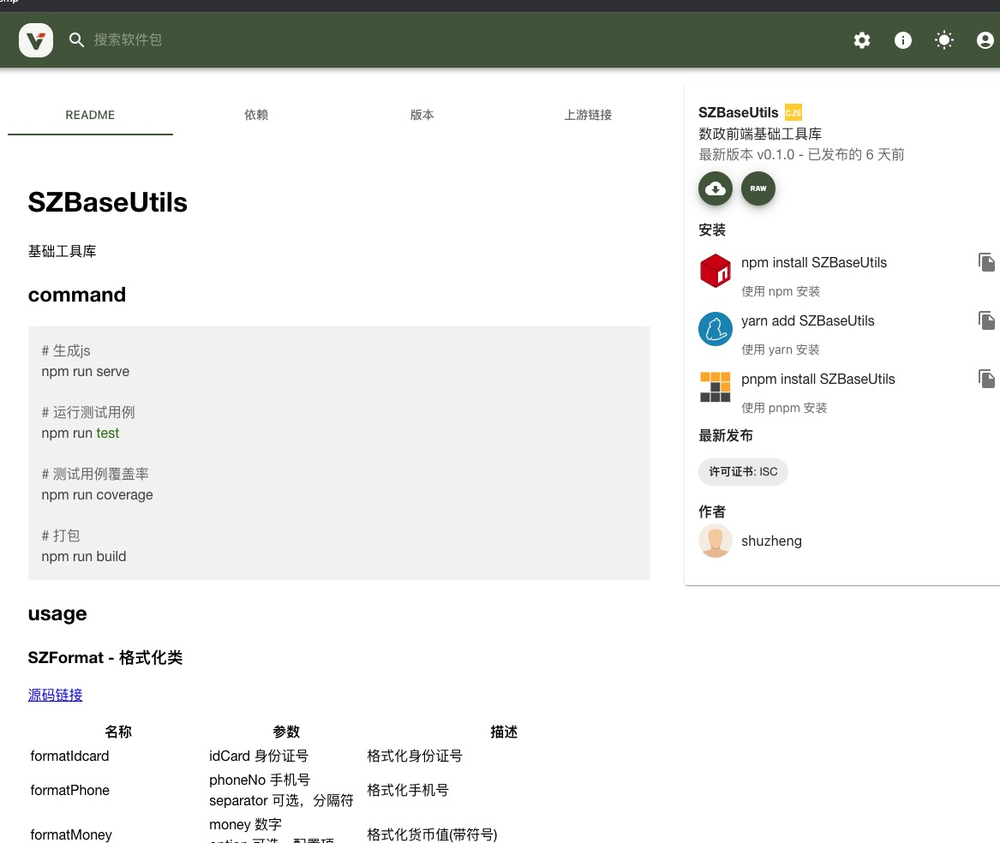

---
<!-- 
_header: 工作反思
_class: contentPage horizontalLayout
-->

- 偏内向，比较社恐，不太自信，公司活动参加的比较少，和组外的同事交流过少，存在感很低。
- 技能广度不够，后端运维设计项管等相关知识储备还不够，面对项目，着眼的范围比较小，不能很好地站在全局的角度去思考。
- 做技术分享的能力还有待提升，分享时依赖讲稿和文档，比较拘束不够洒脱，还需要多加练习。

---
<!-- 
_header: 未来规划
_class: contentPage horizontalLayout
-->

- 克服社恐，从多做技术分享做起，一边提升前端技能，一边锻炼口才，提高临场反应速度，慢慢适应人多的环境。
- 好好利用公司的前端专用服务器，多做技术创新，将学来的知识用起来，开发实用的工具，推动前端基础建设。
- 扩展前端以外的知识和能力，多看书，多看云课堂，多问为什么，不懂的请教公司里专业的人，早日成为多边形战士，争取能向外部输出。

---
<!--
_paginate: false
_header: ' '
_footer: 凉亭-赵璐婷&emsp;2023年04月21日&emsp;Thank you for your time and attention.
_class: thanksPage
-->

## 感谢倾听

 

> 希望自己的付出能够得到领导和同事的认可，
> 我会更加努力，创造价值！
